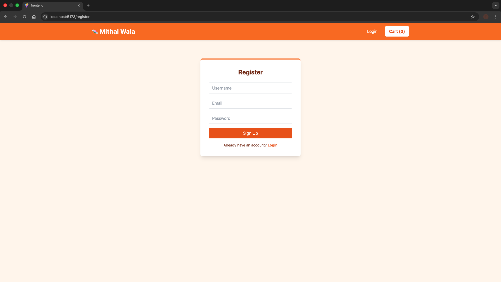
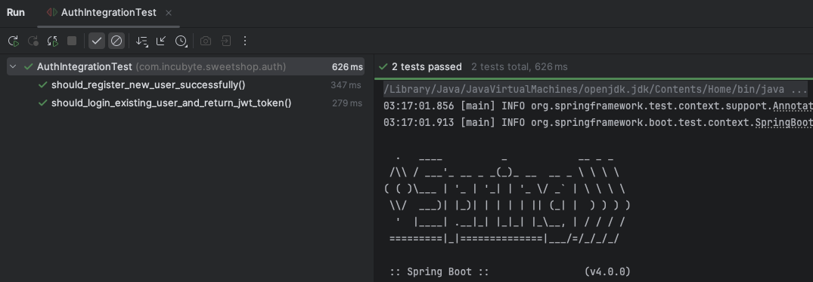
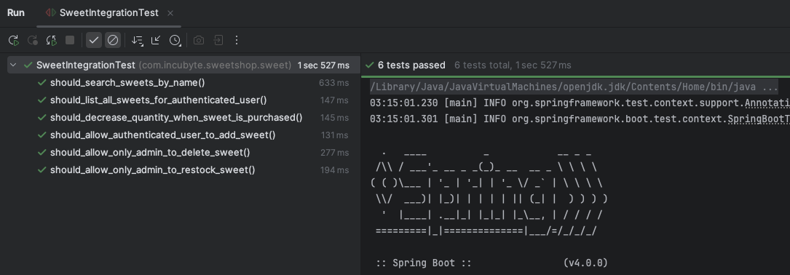

# Sweetshop

# Mithai Wala - Sweet Shop Management System

A full-stack application for managing a sweet shop inventory, built with **Spring Boot** (Backend) and **React** (Frontend). Implementing Role Based Acess Control and following RED-GREEN-REFACTOR Test Driven Development.

## Tech Stack
* **Backend:** Java 17+, Spring Boot 3, Spring Security (JWT), Spring Data JPA
* **Database:** PostgreSQL (Dockerized)
* **Frontend:** React, Vite, Tailwind CSS
* **Testing:** JUnit 5, MockMvc, Testcontainers

## Setup Instructions

### Prerequisites
* Java 17+ and Maven
* Node.js (v18+)
* Docker & Docker Compose

### Login Screen:


### Dashboard


### Test Reports:




### 1. Start the Database
Run the following command in the root directory to spin up PostgreSQL:
```bash
docker compose up -d
```

### 2. Run the Backend
```bash
./mvnw spring-boot:run
```
The API will start at http://localhost:8080.

### 3. Run the Frontend
```bash
cd frontend
npm install
npm run dev
```

### Running Tests:
To run the TDD test suite (Integration Tests with Testcontainers/Docker):
```bash
./mvnw test
```

### Promoting a User(halwai_admin) to Admin:
```bash
docker exec -it sweetshop-db psql -U postgres -d sweetshop -c "UPDATE users SET role = 'ROLE_ADMIN' WHERE username = 'halwai_admin';"
```

### My AI Usage:
Tools Used: Gemini (Google)
- Boilerplate Generation: I used Gemini to generate the initial entity structures (JPA Entities) and standard Repository interfaces to speed up setup.

- Security Configuration: I collaborated with Gemini to correctly configure the Spring Security Filter Chain for JWT validation, specifically navigating the changes in Spring Security 6.4+.

- TDD Workflow: I used Gemini to help generate the initial "Red" failing test cases based on the requirements, ensuring I followed the Red-Green-Refactor cycle strictly.

- Frontend Styling: I used Gemini to generate the Tailwind CSS configuration for the specific "Orange/White" Indian Sweet Shop theme.

### Reflection:
Using AI significantly accelerated the "boring" parts of development (setup, config, CSS), allowing me to focus on the core business logic and TDD flow. It acted as a pair programmer, specifically helping to debug complex issues.